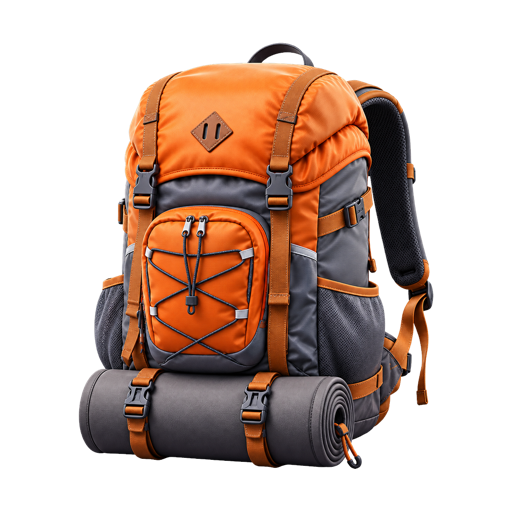

  

# Sherpa

Native macOS app for Statamic. Create, update, and deploy sites without fighting Composer in a terminal.

[sherpa.statamic.com](https://sherpa.statamic.com)

This repository is for **bugs and feature requests**. The app itself is not open source.

Please search existing issues before opening a new one. When reporting a bug, include your macOS version and Sherpa version (**About Sherpa**).

## Security

If you discover a security issue, email [support@statamic.com](mailto:support@statamic.com) instead of using the issue tracker.
